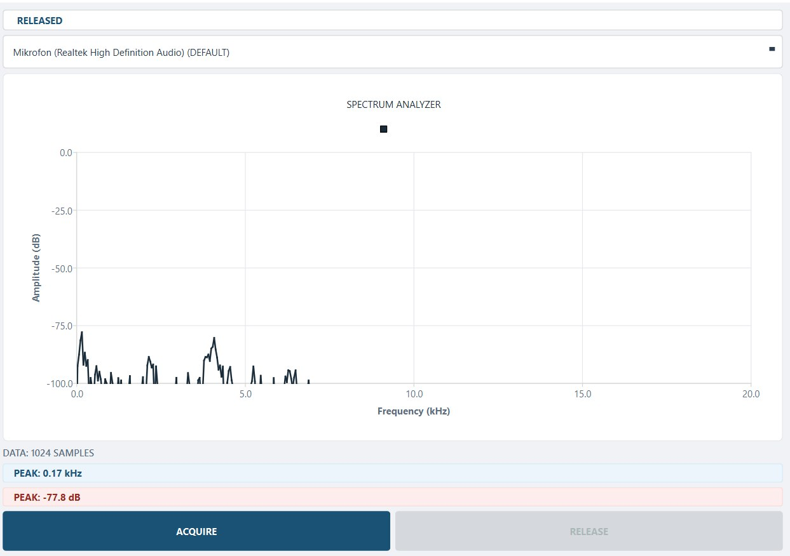
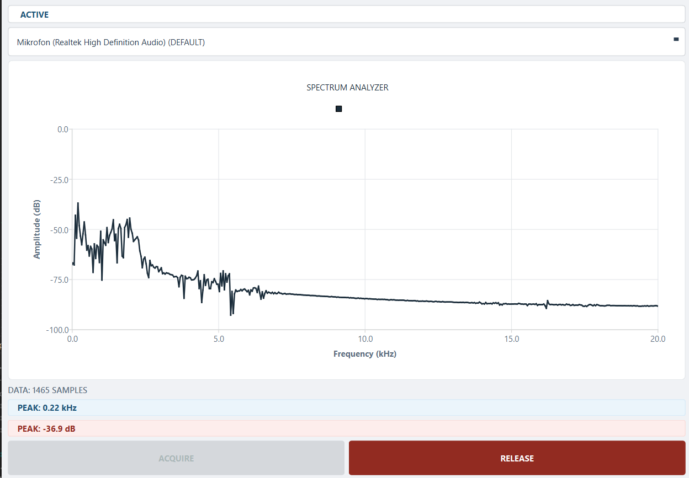

<div align="center">

# 📡 SigWatch
### Real-Time Frequency Spectrum Listener

[](https://isocpp.org/)
[](https://www.qt.io/)
[](https://cmake.org/)
[](https://github.com/sykaya/sigwatch-qt)
[](LICENSE)
[](https://github.com/sykaya/sigwatch-qt)

</div>

---

## 📌 Overview

**SigWatch** is a lightweight, real-time audio frequency spectrum analyzer built with C++17 and Qt6. Designed for signal analysis, audio engineering, and educational purposes.

| | |
|---|---|
| **Language** | C++17 |
| **Framework** | Qt 6.10 |
| **Build System** | CMake 3.16+ |
| **Platform** | Windows 10 / 11, Linux, macOS |
| **License** | MIT |
| **Status** | Stable |

---

## 🖥️ Screenshots

### Main Interface



### Spectrum Analysis



---

## 🚀 Features

| Feature | Description |
|---------|-------------|
| **Live Capture** | Real-time audio input from microphone or line-in |
| **FFT Analysis** | Fast Fourier Transform for frequency domain processing |
| **Spectrum Display** | Real-time visualization with QtCharts |
| **Peak Detection** | Automatic frequency and amplitude peak tracking |
| **Device Selection** | Multiple audio input device support |
| **Lightweight** | Minimal resource usage, fast performance |

---

## 📡 Future Expansion

> **RTL-SDR Support**  
> Future versions will support RTL-SDR and other SDR platforms for radio frequency (RF) signal analysis. This will enable spectrum monitoring of FM radio, amateur radio, air traffic, and other RF communications.

---

## 📦 Installation

### Prerequisites

- Qt 6.4 or higher
- CMake 3.16 or higher
- C++17 compatible compiler

### Build from Source

```bash
git clone https://github.com/sykaya/sigwatch-qt.git
cd sigwatch-qt
mkdir build && cd build
cmake ..
make
./sigwatch-qt
